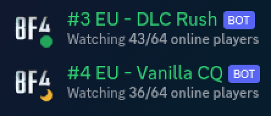

# E4GL BF4/BFHL/BattleBit Status Discord Bot

[](https://gitlab.com/e4gl/BF4StatusBot/-/commits/master)
[](https://discord.e4gl.com/)
[](https://hub.docker.com/r/hedius/bf4statusbot/)

This discord bot allows you to display the player count of your **Battlefield 4**
,**Battlefield Hardline** and **BattleBit Remastered** servers on discord. Furthermore, the bot also displays the current map and changes its
status according to the current population (Online, AFK, DND).




The bot may be run within a container, in a venv, or directly on a host.


# Setup
## 1. docker (docker-compose)
 1. clone the repository
 2. adjust docker-compose.yml with your settings
    (**See chapter: Configuration**)
    - `vim docker-compose.yml`
        * bot token and server guid are needed
    - create an own service for each bot in the docker-compe.yml
 3. sudo docker-compose up -d
 
## 2. venv/host
The bot is not daemonized.
 
1. You only need the folder **src**.
2. (**optional**) switch to a venv
3. Install dependencies
   ```
   cd src
   pip3 install --user -r requirements.txt
   ```
4. Edit the configuration or set environment variables
   (**See chapter: Configuration**)

5. Run the bot from the src folder with ``python3 runBF4StatusBot.py -c PATH_TO_CONFIG_FOLDER``
  
 
# Updating
## docker-compose
1. sudo docker-compose down --rmi all
2. git pull
3. sudo docker-compose up -d

 
# Configuration
## 1. Environment variables
### Required
- BF4STATUSBOT_BOT_TOKEN
    - Discord Bot Token
- BF4STATUSBOT_SERVER_GUID or BF4TATUSBOT_SERVER_NAME
    - GUID of the BF4/BFHL server.
    - Name/Regex for matching your BattleBit server.
    - Both parameters have the same logic. Choose one.
- BF4STATUSBOT_GAME
    - Default: BF4/BFHL
    - Set the variable to `BBR` for BattleBit support.

    
 ### Also needed
You also have to set these variables at the moment. The image has a bug atm and therfore, it does not read the default settings.
- BF4STATUSBOT_CHECK_MAP=true
    - Boolean
    - Should the bot also display the current map?
- BF4STATUSBOT_INTERVAL_PRESENCE_CHANGE=5
    - seconds (int)
    - The interval for presence changes.
- BF4STATUSBOT_INTERVAL_DATA_FETCH=60
    - seconds (int)
    - The interval for sending requests to Battlelog.

## 2. Toml files

You can also use configuration files.

# Docker

Each bot requires its own config.

#### Possibilities:

1. Use environment variables for each container/bot.
2. Use an env file and bind it to the container. (See docker documentation)

#### Not recommended, but possible:

1. Bind config directory
    1. Bind the container directory ``/usr/src/app/config`` to your docker
       host.
    2. Modify ``default.toml`` or copy ``user.toml.example`` to ``user.toml``.
2. Bind config file
    1. Copy the file ``cp src/config/user.toml.example server_1.toml``.
    2. Bind the file to ``/usr/src/app/config/user.toml``

# License

This project is free software and licensed under the GPLv3.
